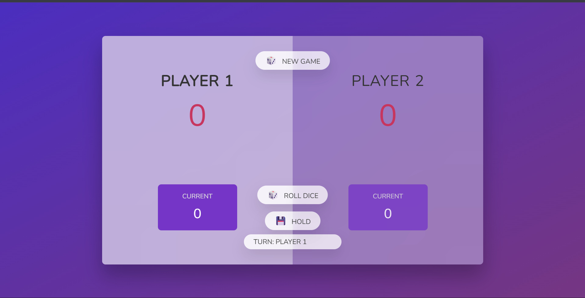

# 🎲 Roll The Dice Game

> **Bahasa / Language:** [🇮🇩 Indonesia](#indonesia) | [🇬🇧 English](#english)

---

## 🇮🇩 Indonesia

### Tentang Project
**Roll The Dice Game** adalah permainan dadu dua pemain berbasis web yang dibangun menggunakan teknologi web dasar tanpa framework apapun. Project ini dibuat sebagai tugas mata kuliah **Pemrograman JavaScript** yang diampu oleh **Yulianto, S.Kom., M.MT.**

### 📸 Screenshot



### 🎮 Aturan Permainan
1. Permainan dimainkan oleh **2 pemain** secara bergantian.
2. Pada setiap giliran, pemain dapat melempar dadu dengan menekan tombol **Roll Dice**.
3. Jika dadu menunjukkan angka **1**, giliran berpindah ke pemain lain dan skor sementara hilang.
4. Jika dadu menunjukkan angka **> 1**, nilai tersebut ditambahkan ke **skor sementara (Current)**.
5. Pemain dapat menekan tombol **Hold** untuk menyimpan skor sementara ke total skor, lalu giliran berpindah.
6. Pemain pertama yang mencapai **100 poin** dinyatakan sebagai **pemenang** 🏆.

### ✨ Fitur
- 🎲 Animasi gambar dadu yang berubah sesuai angka yang keluar
- 🔄 Indikator giliran pemain yang aktif
- 🏆 Modal pemenang yang muncul otomatis saat ada yang menang
- ❓ Modal konfirmasi sebelum memulai game baru
- 🎨 Tampilan modern dengan efek glassmorphism

### 🛠️ Teknologi


### 🚀 Cara Menjalankan
1. Clone atau download repository ini
   ```bash
   git clone https://github.com/Bhayu-Satriaa/roll-the-dice-js.git
   ```
2. Buka folder project
   ```bash
   cd roll-the-dice-js
   ```
3. Buka file `index.html` langsung di browser, atau gunakan ekstensi **Live Server** di VS Code.

> Tidak perlu instalasi apapun! Game langsung berjalan di browser.

### 📁 Struktur File
```
roll-the-dice-js/
├── index.html        # Struktur halaman
├── script.js         # Logika permainan
├── style.css         # Tampilan & layout
├── screenshot.png    # Screenshot game
└── assets/
    ├── dice-1.png
    ├── dice-2.png
    ├── dice-3.png
    ├── dice-4.png
    ├── dice-5.png
    └── dice-6.png
```

### 📚 Informasi Akademik
| | |
|---|---|
| **Mata Kuliah** | Pemrograman JavaScript |
| **Dosen** | Yulianto, S.Kom., M.MT. |

---

## 🇬🇧 English

### About
**Roll The Dice Game** is a two-player web-based dice game built with plain HTML, CSS, and JavaScript — no frameworks, no libraries. This project was created as an assignment for the **JavaScript Programming** course.

### 📸 Screenshot


### 🎮 How to Play
1. The game is played by **2 players** taking turns.
2. On each turn, a player can roll the dice by pressing the **Roll Dice** button.
3. If the dice shows **1**, the turn passes to the other player and the current score is lost.
4. If the dice shows **> 1**, the value is added to the **current score**.
5. A player can press **Hold** to save the current score to their total score, then the turn passes.
6. The first player to reach **100 points** wins 🏆.

### ✨ Features
- 🎲 Dice image that changes based on the rolled number
- 🔄 Turn indicator showing the active player
- 🏆 Winner modal that appears automatically when someone wins
- ❓ Confirmation modal before starting a new game
- 🎨 Modern UI with glassmorphism effect

### 🛠️ Built With


### 🚀 How to Run
1. Clone or download this repository
   ```bash
   git clone https://github.com/Bhayu-Satriaa/roll-the-dice-js.git
   ```
2. Open the project folder
   ```bash
   cd roll-the-dice-js
   ```
3. Open `index.html` directly in your browser, or use the **Live Server** extension in VS Code.

> No installation needed! The game runs directly in the browser.

### 📁 File Structure
```
roll-the-dice-js/
├── index.html        # Page structure
├── script.js         # Game logic
├── style.css         # Styling & layout
├── screenshot.png    # Game screenshot
└── assets/
    ├── dice-1.png
    ├── dice-2.png
    ├── dice-3.png
    ├── dice-4.png
    ├── dice-5.png
    └── dice-6.png
```

### 📚 Academic Info
| | |
|---|---|
| **Course** | JavaScript Programming |
| **Lecturer** | Yulianto, S.Kom., M.MT. |

---

<p align="center">Made with ❤️ using Vanilla JavaScript</p>